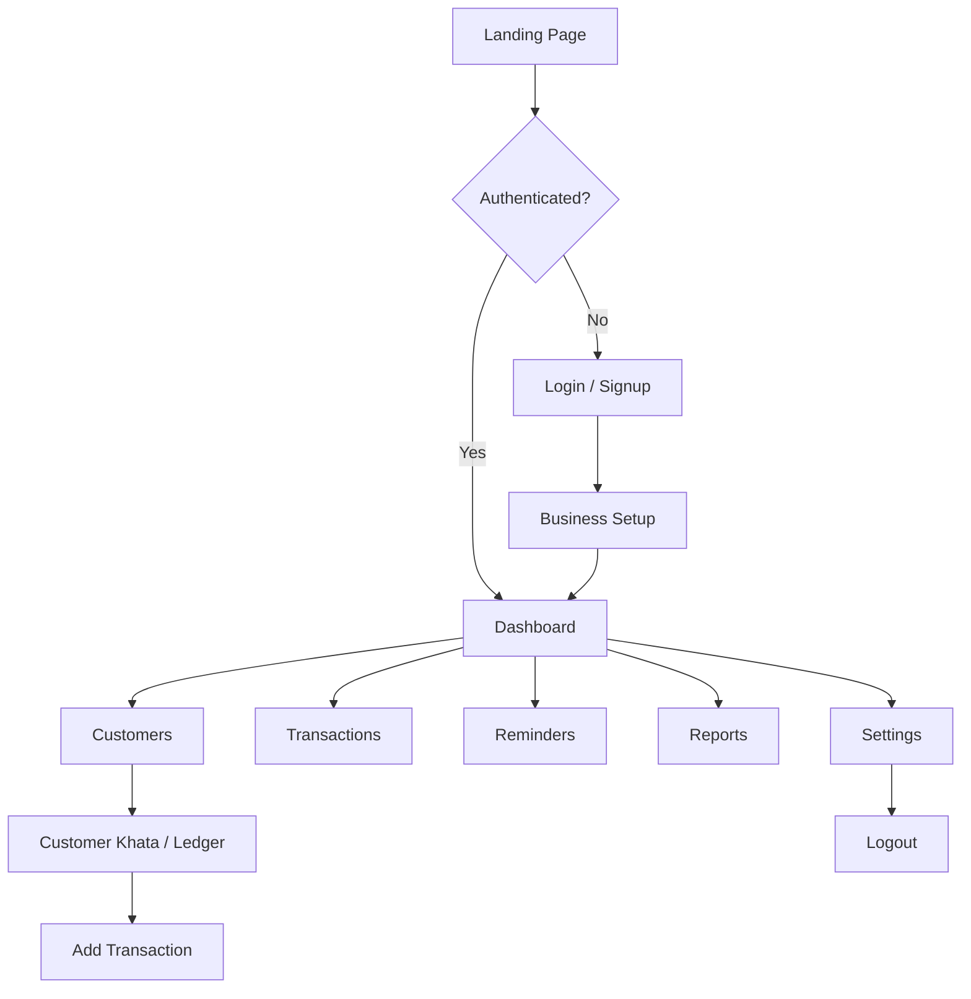

# HisabDo – Main Capstone Project (Day 9)

> **Track:** MERN / Next.js
> **Day 9 Focus:** Project setup, UI implementation & responsive layouts

This repository contains a working **Next.js** web implementation of the
**HisabDo** digital bookkeeping (khata) ecosystem — from marketing website to the
authenticated bookkeeping app.

---

## Table of Contents

1. [What is HisabDo](#what-is-hisabdo)
2. [What's Implemented (Day 9)](#whats-implemented-day-9)
3. [Pages & Routes](#pages--routes)
4. [Folder Structure](#folder-structure)
5. [Design System](#design-system)
6. [Responsive Layout](#responsive-layout)
7. [Technology Stack](#technology-stack)
8. [Setup & Run](#setup--run)
9. [Submission Checklist](#submission-checklist)

---

## What is HisabDo

**HisabDo** is a Pakistani digital bookkeeping (khata/ledger) application that
helps small shopkeepers and small businesses track credit/debit records, send
payment reminders, and understand their business with simple reports.

### User Flow



---

## What's Implemented (Day 9)

- ✅ Next.js 14 (App Router) project configured and running
- ✅ ESLint configured with `next/core-web-vitals` — **lint passes with zero errors**
- ✅ TypeScript strict mode — **type check passes**
- ✅ Production build compiles successfully (27 static pages)
- ✅ Clean, scalable folder structure with route groups
  - `(marketing)` – public website
  - `(auth)` – login/signup
  - `(app)` – authenticated khata application
- ✅ Initial layout:
  - Sticky responsive **Header/Navbar** with mobile menu
  - **Sidebar** for the app area (mobile drawer + desktop fixed)
  - **Footer** with links & socials
  - Responsive layouts for desktop, tablet and mobile
- ✅ **14+ major pages implemented**:
  - **Home/Landing** – hero, features, how-it-works, CTA
  - **Features** – full feature grid + reminders showcase
  - **Pricing** – tiered plans with highlight badge
  - **Dashboard** – KPIs, recent entries, quick actions
  - **Customers** – customer grid, search, tags
  - **Customer Khata** – per-customer ledger with running balance
  - **Transactions** – entry form + all entries list
  - **Reports** – KPIs, monthly bar chart, top customers
  - **Reminders** – SMS/WhatsApp reminders with status tracking
  - **Settings** – business profile, backup, security, notifications
  - **About, Blog, Contact, FAQ (accordion), Download, Privacy, Terms**
  - **Auth** – Login, Signup
- ✅ Fully responsive: mobile, tablet, desktop
- ✅ Brutalist design system with Tailwind custom tokens

---

## Pages & Routes

| # | Page | Route |
|---|------|-------|
| 1 | Home / Landing | `/` |
| 2 | Features | `/features` |
| 3 | Pricing | `/pricing` |
| 4 | About | `/about` |
| 5 | Blog | `/blog` |
| 6 | Contact | `/contact` |
| 7 | FAQ | `/faq` |
| 8 | Download | `/download` |
| 9 | Privacy Policy | `/privacy` |
| 10 | Terms of Service | `/terms` |
| 11 | Login | `/auth/login` |
| 12 | Signup | `/auth/signup` |
| 13 | Dashboard | `/app` |
| 14 | Customers | `/app/customers` |
| 15 | Customer Khata | `/app/customers/[id]` |
| 16 | Transactions | `/app/transactions` |
| 17 | Reminders | `/app/reminders` |
| 18 | Reports | `/app/reports` |
| 19 | Settings | `/app/settings` |

---

## Folder Structure

```
src/
├── app/
│   ├── (marketing)/          # Public website (Navbar + Footer layout)
│   │   ├── page.tsx          # Home
│   │   ├── features/
│   │   ├── pricing/
│   │   ├── about/
│   │   ├── blog/
│   │   ├── contact/
│   │   ├── faq/
│   │   │   └── FAQAccordion.tsx
│   │   ├── download/
│   │   ├── privacy/          # under legal/ layout
│   │   └── terms/            # under legal/ layout
│   ├── (auth)/               # Auth pages
│   │   ├── login/
│   │   └── signup/
│   ├── (app)/                # Authenticated khata app (Sidebar layout)
│   │   ├── app/
│   │   │   ├── page.tsx          # Dashboard
│   │   │   ├── customers/
│   │   │   │   └── [id]/         # Customer khata ledger
│   │   │   ├── transactions/
│   │   │   ├── reminders/
│   │   │   ├── reports/
│   │   │   └── settings/
│   │   └── layout.tsx         # AppShell layout
│   ├── layout.tsx             # Root layout + metadata
│   └── globals.css            # Tailwind base + custom tokens
├── components/
│   ├── layout/               # Navbar, Footer, AppSidebar, AppTopbar, AppShell
│   ├── transactions/         # TransactionForm
│   └── ui/                   # Button, Card, Badge, Input, Logo, FeatureIcon
├── lib/
│   └── data.ts               # Mock data & helpers
└── types/
    └── index.ts              # TypeScript types
```

---

## Design System

A **cartoon brutalist** design language with:

- Bold **black outlines** (`border-2 border-ink` on cards/buttons)
- Flat solid colors — blue `primary`, green `accent`, warm cream & blue section backgrounds
- Chunky drop shadows (`shadow-brutal`, `shadow-brutal-sm`, `shadow-brutal-lg`)
- Expressive chunky typography (`font-extrabold` headings)
- Zero gradients

Custom Tailwind theme tokens: `primary`, `accent`, `ink`, `warn`, `danger`, `brutal` shadows/radii.

---

## Responsive Layout

- **Marketing layout**: sticky navbar collapses to a mobile hamburger menu below `md`; footer stacks.
- **App layout**: fixed sidebar on `lg+`, slide-in drawer with overlay on smaller screens; topbar has mobile menu button; content grids collapse from 4 → 2 → 1 columns.
- All pages tested with fluid grids, `sm:`/`md:`/`lg:`/`xl:` breakpoints, and horizontally scrollable tables on narrow screens.

---

## Technology Stack

- **Next.js 14** (App Router, RSC + client components)
- **React 18**
- **TypeScript** (strict)
- **Tailwind CSS 3**
- **lucide-react** (icons)
- **ESLint** with `next/core-web-vitals`

---

## Setup & Run

```bash
# Install dependencies
npm install

# Run development server
npm run dev

# Lint
npm run lint

# Type check
npx tsc --noEmit

# Build for production
npm run build

# Start production server
npm start
```

Open [http://localhost:3000](http://localhost:3000).

---

## Screenshots

### Marketing Pages

#### Home — Desktop


#### Home — Mobile


#### Features


#### Pricing


#### Login


#### Signup


### App Pages

#### Dashboard — Desktop


#### Dashboard — Mobile


#### Customers


#### Customer Khata (Ledger)


#### Transactions


#### Reports


#### Reminders


#### Settings


---

## Submission Checklist

- [x] GitHub repository — [https://github.com/Bilalrasheedsatti/hisabdo-day9-mern](https://github.com/Bilalrasheedsatti/hisabdo-day9-mern)
- [x] Working Next.js project (build passes, 27 static pages)
- [x] Screenshots/video of implemented pages
- [x] Updated README
- [x] ESLint passes with zero errors
- [x] TypeScript type check passes
