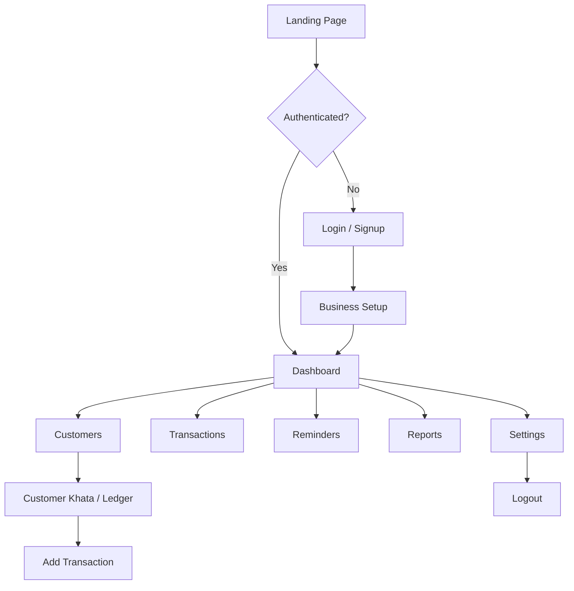

# HisabDo – Capstone Project (Day 11)

> **Track:** MERN / Next.js
> **Day 11 Focus:** Second functional module (Customers), CRUD UI, validation, states, responsive design

This repository contains the **Day 11** implementation of the **HisabDo** digital
bookkeeping (khata) ecosystem — extending the Day 10 foundation with a second
fully functional module (Customers), CRUD-style UI, loading/empty/error states,
and additional reusable components.

---

## Table of Contents

1. [What is HisabDo](#what-is-hisabdo)
2. [What's Implemented (Day 10)](#whats-implemented-day-10)
3. [Pages & Routes](#pages--routes)
4. [Folder Structure](#folder-structure)
5. [Design System](#design-system)
6. [Responsive Layout](#responsive-layout)
7. [Technology Stack](#technology-stack)
8. [Setup & Run](#setup--run)
9. [Submission Checklist](#submission-checklist)

---

## What is HisabDo

**HisabDo** is a Pakistani digital bookkeeping (khata/ledger) application that
helps small shopkeepers and small businesses track credit/debit records, send
payment reminders, and understand their business with simple reports.

### User Flow



---

## What's Implemented (Day 11)

- ✅ Next.js 14 (App Router) project configured and running
- ✅ ESLint configured with `next/core-web-vitals` — **lint passes with zero errors**
- ✅ TypeScript strict mode — **type check passes**
- ✅ Production build compiles successfully
- ✅ Clean, scalable folder structure with route groups
  - `(marketing)` – public website
  - `(auth)` – login/signup
  - `(app)` – authenticated khata application
- ✅ **Main application layout** with responsive sidebar + topbar
- ✅ **Working Dashboard** with live KPI cards, recent entries, and quick actions
- ✅ **Functional Transactions module** with React Context state management:
  - Add new credit/debit entries via validated form
  - Entries persist across pages during the session
  - Real-time list updates in Transactions page and Dashboard
- ✅ **Functional Customers module** with full CRUD:
  - Add new customers via validated modal form
  - Edit existing customer details
  - Delete customers with confirmation
  - Real-time search/filter
  - Table view on desktop, card view on mobile
  - Loading, empty, and error states
- ✅ **Reusable UI components**:
  - `Button` – primary, secondary, ghost, danger, accent variants with sizes
  - `Card` – consistent bordered container with brutal shadow
  - `Badge` – neutral, accent, warn, danger, primary variants
  - `Input` / `Textarea` / `Select` – form fields with labels
  - `Table` / `TableHead` / `TableBody` / `TableRow` / `TableCell` / `TableHeaderCell` – reusable data table
  - `Modal` – overlay dialog for forms and confirmations
  - `Logo` / `FeatureIcon` – brand components
- ✅ **Proper form validation** in TransactionForm and CustomerForm:
  - Customer selection required, amount positive with max limit, date required
  - Customer name min length, phone format validation, business required
  - Inline error messages with danger styling
  - Success feedback on valid submission
- ✅ **Navigation between pages** via sidebar + topbar
- ✅ **Responsive UI** across all breakpoints:
  - Mobile hamburger menu with overlay
  - Collapsible sidebar drawer
  - Fluid grids (4 → 2 → 1 columns)
  - Horizontally scrollable tables
  - Mobile-first card layouts
- ✅ **14+ pages** fully built and styled

---

## Pages & Routes

| # | Page | Route |
|---|------|-------|
| 1 | Home / Landing | `/` |
| 2 | Features | `/features` |
| 3 | Pricing | `/pricing` |
| 4 | About | `/about` |
| 5 | Blog | `/blog` |
| 6 | Contact | `/contact` |
| 7 | FAQ | `/faq` |
| 8 | Download | `/download` |
| 9 | Privacy Policy | `/privacy` |
| 10 | Terms of Service | `/terms` |
| 11 | Login | `/auth/login` |
| 12 | Signup | `/auth/signup` |
| 13 | Dashboard | `/app` |
| 14 | Customers | `/app/customers` |
| 15 | Customer Khata | `/app/customers/[id]` |
| 16 | Transactions | `/app/transactions` |
| 17 | Reminders | `/app/reminders` |
| 18 | Reports | `/app/reports` |
| 19 | Settings | `/app/settings` |

---

## Folder Structure

```
src/
├── app/
│   ├── (marketing)/          # Public website (Navbar + Footer layout)
│   │   ├── page.tsx          # Home
│   │   ├── features/
│   │   ├── pricing/
│   │   ├── about/
│   │   ├── blog/
│   │   ├── contact/
│   │   ├── faq/
│   │   │   └── FAQAccordion.tsx
│   │   ├── download/
│   │   ├── privacy/          # under legal/ layout
│   │   └── terms/            # under legal/ layout
│   ├── (auth)/               # Auth pages
│   │   ├── login/
│   │   └── signup/
│   ├── (app)/                # Authenticated khata app (Sidebar layout)
│   │   ├── app/
│   │   │   ├── page.tsx          # Dashboard
│   │   │   ├── customers/
│   │   │   │   └── [id]/         # Customer khata ledger
│   │   │   ├── transactions/
│   │   │   ├── reminders/
│   │   │   ├── reports/
│   │   │   └── settings/
│   │   │   └── layout.tsx         # AppShell layout
│   │   └── layout.tsx         # AppShell layout
│   ├── layout.tsx             # Root layout + metadata
│   └── globals.css            # Tailwind base + custom tokens
├── components/
│   ├── layout/               # Navbar, Footer, AppSidebar, AppTopbar, AppShell
│   ├── transactions/         # TransactionForm
│   ├── customers/            # CustomerForm, CustomersClient
│   └── ui/                   # Button, Card, Badge, Input, Modal, Table, Logo, FeatureIcon
├── context/
│   ├── TransactionContext.tsx # Transactions state management
│   └── CustomerContext.tsx    # Customers state management
├── lib/
│   └── data.ts               # Mock data & helpers
└── types/
    └── index.ts              # TypeScript types
```

---

## Design System

A **cartoon brutalist** design language with:

- Bold **black outlines** (`border-2 border-ink` on cards/buttons)
- Flat solid colors — blue `primary`, green `accent`, warm cream & blue section backgrounds
- Chunky drop shadows (`shadow-brutal`, `shadow-brutal-sm`, `shadow-brutal-lg`)
- Expressive chunky typography (`font-extrabold` headings)
- Zero gradients

Custom Tailwind theme tokens: `primary`, `accent`, `ink`, `warn`, `danger`, `brutal` shadows/radii.

---

## Responsive Layout

- **Marketing layout**: sticky navbar collapses to a mobile hamburger menu below `md`; footer stacks.
- **App layout**: fixed sidebar on `lg+`, slide-in drawer with overlay on smaller screens; topbar has mobile menu button; content grids collapse from 4 → 2 → 1 columns.
- All pages tested with fluid grids, `sm:`/`md:`/`lg:`/`xl:` breakpoints, and horizontally scrollable tables on narrow screens.

---

## Technology Stack

- **Next.js 14** (App Router, RSC + client components)
- **React 18**
- **TypeScript** (strict)
- **Tailwind CSS 3**
- **lucide-react** (icons)
- **ESLint** with `next/core-web-vitals`

---

## Setup & Run

```bash
# Install dependencies
npm install

# Run development server
npm run dev

# Lint
npm run lint

# Type check
npx tsc --noEmit

# Build for production
npm run build

# Start production server
npm start
```

Open [http://localhost:3000](http://localhost:3000).

---

## Day 11 Implementation Highlights

### Reusable Components

| Component | Location | Purpose |
|-----------|----------|---------|
| `Button` | `src/components/ui/Button.tsx` | Multi-variant, multi-size button with link support |
| `Card` | `src/components/ui/Card.tsx` | Bordered container with brutal shadow |
| `Badge` | `src/components/ui/Badge.tsx` | Status chips with semantic colors |
| `Input` | `src/components/ui/Input.tsx` | Labeled input, textarea, select |
| `Table` | `src/components/ui/Table.tsx` | Composable data table with header/body/row/cell |
| `Modal` | `src/components/ui/Modal.tsx` | Overlay dialog for forms and confirmations |
| `AppSidebar` | `src/components/layout/AppSidebar.tsx` | Responsive navigation drawer |
| `AppTopbar` | `src/components/layout/AppTopbar.tsx` | Sticky header with search + actions |

### Form Validation (TransactionForm)

- **Customer**: must be selected (error: "Please select a customer")
- **Amount**: required, must be positive, max 10,000,000 (error messages for missing/invalid/too large)
- **Date**: required (error: "Date is required")
- Inline error messages styled with `text-danger`
- Success message on valid submission

### Form Validation (CustomerForm)

- **Name**: required, min 2 characters
- **Phone**: required, must be valid Pakistani phone format (03xxxxxxxxx)
- **Business**: required
- **Tags**: optional comma-separated list
- Inline error messages styled with `text-danger`
- Success message on valid submission

### Functional Module 1: Transactions

- `TransactionContext` provides global state for transactions
- `TransactionForm` dispatches new entries via `addTransaction`
- `TransactionsClient` renders live table of all entries with responsive layout
- `DashboardPage` shows the 5 most recent entries
- `CustomerKhataPage` filters transactions by customer and computes running balance

### Functional Module 2: Customers

- `CustomerContext` provides global state for customers with async CRUD operations
- `CustomerForm` handles add and edit modes with validation
- `CustomersClient` renders a data table on desktop and card grid on mobile
- Features real-time search, loading states, empty state, and error state
- Delete confirmation via reusable `Modal`
- Dashboard KPIs are computed dynamically from actual customer and transaction data
- Customer detail page (`/app/customers/[id]`) reads from context instead of static data

---

## Submission Checklist

- [x] GitHub repository — [https://github.com/Bilalrasheedsatti/hisabdo-day11-mern](https://github.com/Bilalrasheedsatti/hisabdo-day11-mern)
- [x] Working Dashboard with live data
- [x] Two functional modules (Transactions + Customers with CRUD)
- [x] Navigation between pages (Sidebar + Topbar)
- [x] Responsive UI (mobile, tablet, desktop)
- [x] Reusable components (Button, Card, Badge, Input, Modal, Table, Nav)
- [x] Form validation (TransactionForm + CustomerForm)
- [x] Loading, empty, and error states
- [x] ESLint passes with zero errors
- [x] TypeScript type check passes
- [x] Production build succeeds
