# HisabDo – Capstone Project (Day 12)

> **Track:** MERN / Next.js
> **Day 12 Focus:** Third functional module (Reminders) with full CRUD, authentication-protected pages structure, improved navigation, and loading/empty/error states

This repository contains the **Day 12** implementation of the **HisabDo** digital
bookkeeping (khata) ecosystem. Building on the Days 10–11 foundation (Transactions +
Customers), Day 12 adds a **third core module — Reminders** with full CRUD, a complete
**authentication-protected pages structure** (AuthProvider + ProtectedRoute + validated
login/signup), improved navigation between modules, and reusable-state handling.

---

## Table of Contents

1. [What is HisabDo](#what-is-hisabdo)
2. [What's Implemented](#whats-implemented)
3. [Pages & Routes](#pages--routes)
4. [Folder Structure](#folder-structure)
5. [Design System](#design-system)
6. [Authentication (Protected Pages)](#authentication-protected-pages)
7. [Screenshots](#screenshots)
8. [Responsive Layout](#responsive-layout)
9. [Technology Stack](#technology-stack)
10. [Setup & Run](#setup--run)
11. [Submission Checklist](#submission-checklist)

---

## What is HisabDo

**HisabDo** is a Pakistani digital bookkeeping (khata/ledger) application that
helps small shopkeepers and small businesses track credit/debit records, send
payment reminders, and understand their business with simple reports.

### User Flow

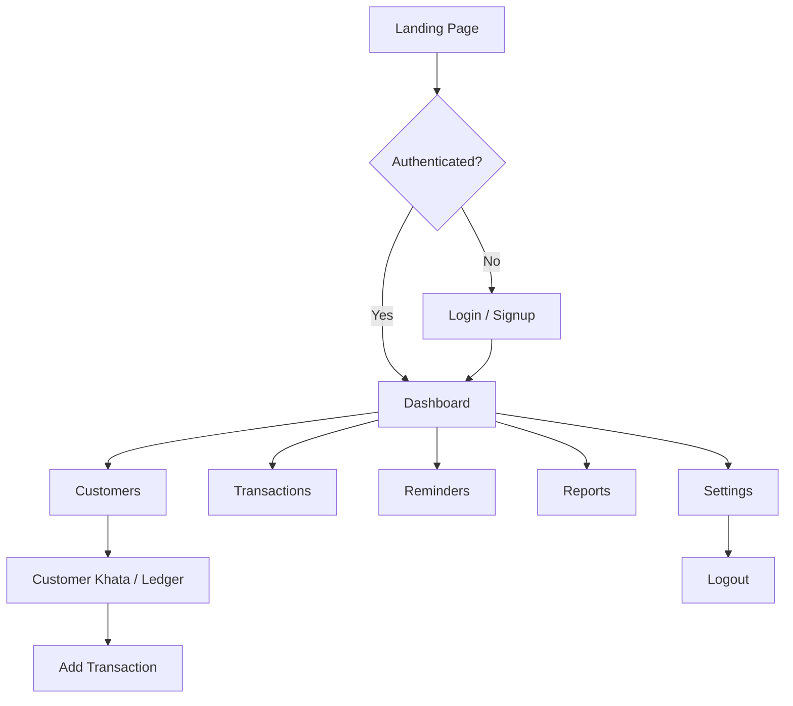

---

## What's Implemented

- ✅ Next.js 14 (App Router) project configured and running
- ✅ ESLint configured with `next/core-web-vitals` — **lint passes with zero errors**
- ✅ TypeScript strict mode — **type check passes**
- ✅ Production build compiles successfully
- ✅ Clean, scalable folder structure with route groups
  - `(marketing)` – public website
  - `auth` – login/signup
  - `(app)` – authenticated khata application
- ✅ **Main application layout** with responsive sidebar + topbar

### Core Functional Modules (3)

- ✅ **Module 1 — Transactions** (`TransactionContext`): add credit/debit entries via a validated form; live list updates; customer names resolved and linked to each Khata page.
- ✅ **Module 2 — Customers** (`CustomerContext`): full CRUD (add/edit/delete), search/filter, table + mobile cards, loading/empty/error states, validated `CustomerForm`.
- ✅ **Module 3 — Reminders** (`ReminderContext`): full CRUD (add/edit/delete), search + status filter, table + mobile cards, loading/empty/error states, validated `ReminderForm`.

### State & Validation

- ✅ **Loading**: spinner card while data loads and during mutations (add/edit/delete) in Customers and Reminders.
- ✅ **Empty**: friendly empty state with illustration and call-to-action.
- ✅ **Error**: dismissible inline error banners for failed load and mutation operations.
- ✅ **Form validation** across all module forms and auth forms (inline `text-danger` messages):
  - `CustomerForm` — name (min 2 chars), Pakistani phone format, business required, optional tags.
  - `TransactionForm` — customer required, positive amount (max 10,000,000), date required.
  - `ReminderForm` — customer required, positive amount, method required, scheduled date required, optional note.
  - `LoginForm` — phone format + password (min 6).
  - `SignupForm` — business name, phone format, password (min 6), terms required.

### Authentication (Protected Pages)

- ✅ `AuthContext` with `login`/`signup`/`logout` and `localStorage` persistence.
- ✅ `AuthProvider` wraps the root layout.
- ✅ `ProtectedRoute` guards the entire `/app` section (spinner while booting, redirect to `/auth/login` when unauthenticated).
- ✅ App sidebar shows the logged-in user and a **Logout** action.
- ✅ Auth pages redirect to `/app` when already authenticated; login/signup call the real auth methods.

### Navigation

- ✅ Sidebar navigation across Dashboard, Customers, Transactions, Reminders, Reports, Settings.
- ✅ AppTopbar "New Entry" links to `/app/transactions`.
- ✅ Marketing `Navbar` is auth-aware (shows Dashboard when logged in).
- ✅ Transactions list links customer names to their Khata ledger.
- ✅ Dashboard quick actions link to every module.
- ✅ Mobile hamburger drawer with overlay.

### Reusable UI Components

| Component | Location | Purpose |
|-----------|----------|---------|
| `Button` | `src/components/ui/Button.tsx` | Multi-variant, multi-size button with link support |
| `Card` | `src/components/ui/Card.tsx` | Bordered container with brutal shadow |
| `Badge` | `src/components/ui/Badge.tsx` | Status chips with semantic colors |
| `Input` / `Textarea` / `Select` | `src/components/ui/Input.tsx` | Form fields with labels |
| `Table` / `TableHead` / `TableBody` / `TableRow` / `TableCell` / `TableHeaderCell` | `src/components/ui/Table.tsx` | Composable data table |
| `Modal` | `src/components/ui/Modal.tsx` | Overlay dialog for forms and confirmations |
| `ProtectedRoute` | `src/components/auth/ProtectedRoute.tsx` | Auth guard for protected pages |
| `AppSidebar` / `AppTopbar` / `AppShell` | `src/components/layout/` | App chrome navigation |
| `Logo` / `FeatureIcon` | `src/components/ui/` | Brand components |

### State Contexts

| Context | Location | Scope |
|---------|----------|-------|
| `TransactionContext` | `src/context/TransactionContext.tsx` | Transactions (add) |
| `CustomerContext` | `src/context/CustomerContext.tsx` | Customers (full CRUD) |
| `ReminderContext` | `src/context/ReminderContext.tsx` | Reminders (full CRUD) |
| `AuthContext` | `src/context/AuthContext.tsx` | Auth session (login/signup/logout) |

---

## Pages & Routes

| # | Page | Route | Protected |
|---|------|-------|:---------:|
| 1 | Home / Landing | `/` | — |
| 2 | Features | `/features` | — |
| 3 | Pricing | `/pricing` | — |
| 4 | About | `/about` | — |
| 5 | Blog | `/blog` | — |
| 6 | Contact | `/contact` | — |
| 7 | FAQ | `/faq` | — |
| 8 | Download | `/download` | — |
| 9 | Privacy Policy | `/privacy` | — |
| 10 | Terms of Service | `/terms` | — |
| 11 | Login | `/auth/login` | — |
| 12 | Signup | `/auth/signup` | — |
| 13 | Dashboard | `/app` | ✅ |
| 14 | Customers | `/app/customers` | ✅ |
| 15 | Customer Khata | `/app/customers/[id]` | ✅ |
| 16 | Transactions | `/app/transactions` | ✅ |
| 17 | Reminders | `/app/reminders` | ✅ |
| 18 | Reports | `/app/reports` | ✅ |
| 19 | Settings | `/app/settings` | ✅ |

---

## Folder Structure

```
src/
├── app/
│   ├── (marketing)/          # Public website (Navbar + Footer layout)
│   │   └── page.tsx, features/, pricing/, about/, …
│   ├── auth/                  # Auth pages (login, signup)
│   │   └── layout.tsx         # Auth layout
│   ├── (app)/                # Authenticated khata app (Sidebar layout)
│   │   ├── layout.tsx         # Providers + ProtectedRoute + AppShell
│   │   └── app/
│   │       ├── page.tsx          # Dashboard
│   │       ├── customers/
│   │       │   └── [id]/         # Customer khata ledger
│   │       ├── transactions/
│   │       ├── reminders/         # ← Day 12: full CRUD module
│   │       ├── reports/
│   │       └── settings/
│   ├── layout.tsx             # Root layout + metadata + AuthProvider
│   └── globals.css            # Tailwind base + custom tokens
├── components/
│   ├── auth/                 # ProtectedRoute
│   ├── layout/               # Navbar, Footer, AppSidebar, AppTopbar, AppShell
│   ├── transactions/         # TransactionForm
│   ├── customers/            # CustomerForm, CustomersClient
│   ├── reminders/            # ← Day 12: ReminderForm, RemindersClient
│   └── ui/                   # Button, Card, Badge, Input, Modal, Table, Logo, FeatureIcon
├── context/
│   ├── AuthContext.tsx       # ← Day 12: auth session provider
│   ├── TransactionContext.tsx
│   ├── CustomerContext.tsx
│   └── ReminderContext.tsx   # ← Day 12: reminders CRUD
├── lib/
│   └── data.ts               # Mock data, nav, helpers
└── types/
    └── index.ts              # TypeScript types (incl. Reminder)
```

---

## Authentication (Protected Pages)

Day 12 prepares the UI structure for authentication-protected pages:

1. **`AuthContext`** (`src/context/AuthContext.tsx`) holds `user`, `loading`, and the
   `login`/`signup`/`logout` actions. The session is persisted to `localStorage`
   (`hisabdo.user`) so a refresh keeps the user authenticated.
2. **`AuthProvider`** wraps the root layout, making auth state available to every route.
3. **`ProtectedRoute`** (`src/components/auth/ProtectedRoute.tsx`) wraps the app shell inside
   `src/app/(app)/layout.tsx`. While the session is being restored it shows a centered
   spinner; once resolved it either redirects to `/auth/login` (unauthenticated) or renders
   the protected children.
4. **Login & Signup** forms validate input, call the real `login()` / `signup()` methods,
   and redirect to `/app` on success. Both screens redirect to `/app` if already logged in.
5. **Logout** is available in the app sidebar footer, and the marketing Navbar shows a
   "Dashboard" link when authenticated.

> Note: authentication is currently simulated client-side (any valid phone + 6+ char
> password succeeds). This is intentional for the UI milestone; wire it to a real backend
> (JWT/session) in a later milestone.

---

## Design System

A **cartoon brutalist** design language with:

- Bold **black outlines** (`border-2 border-ink` on cards/buttons)
- Flat solid colors — blue `primary`, green `accent`, warm cream & blue section backgrounds
- Chunky drop shadows (`shadow-brutal`, `shadow-brutal-sm`, `shadow-brutal-lg`, `shadow-brutal-primary`)
- Expressive chunky typography (`font-extrabold` headings)
- Zero gradients

Custom Tailwind theme tokens: `primary`, `accent`, `ink`, `warn`, `danger`, `brutal`
shadows/radii (see `tailwind.config.ts`).

---

## Responsive Layout

- **Marketing layout**: sticky navbar collapses to a mobile hamburger menu below `md`; footer stacks.
- **App layout**: fixed sidebar on `lg+`, slide-in drawer with overlay on smaller screens; topbar has a
  mobile menu button; content grids collapse from 4 → 2 → 1 columns.
- All pages use fluid grids, `sm:`/`md:`/`lg:`/`xl:` breakpoints, and horizontally scrollable tables
  on narrow screens; module lists switch from a desktop table to mobile cards.

---

## Screenshots

Screenshots were captured against a local dev server with Playwright (`npm run screenshot`).
The authenticated app pages are shown signed in. All images live in [`screenshots/`](screenshots/).

### Marketing & Auth
| Login | Signup |
|-------|--------|
| 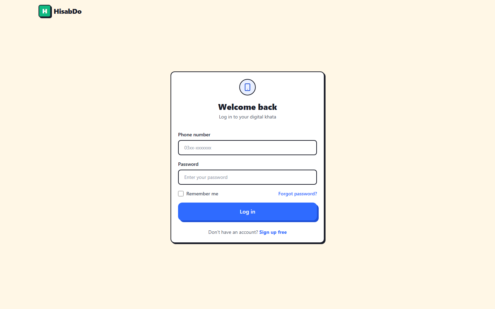 | 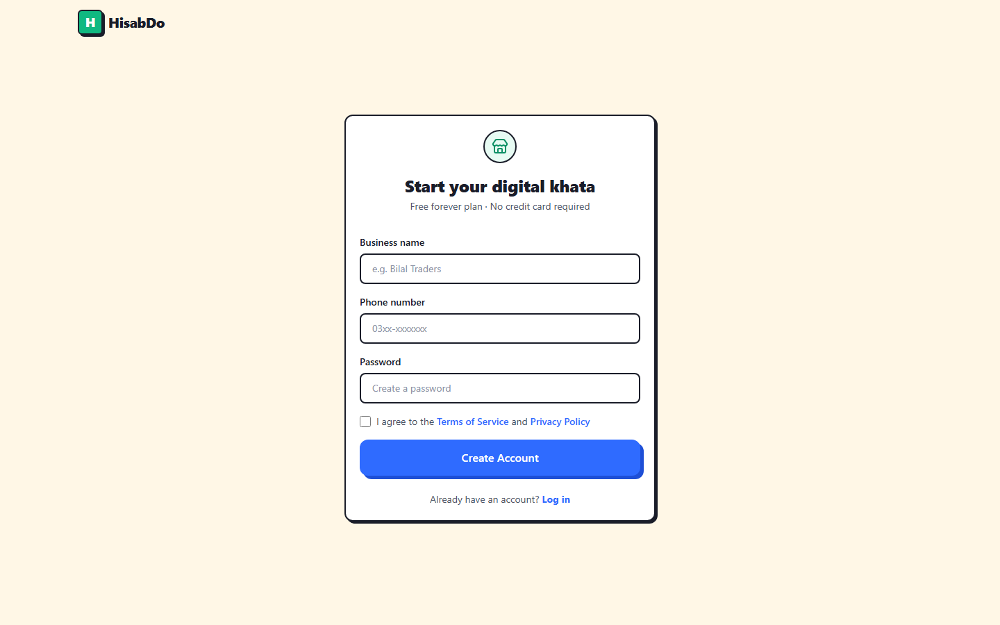 |

### App — Core Modules (responsive)
| Dashboard (desktop) | Dashboard (mobile) | Customers |
|---|---|---|
| 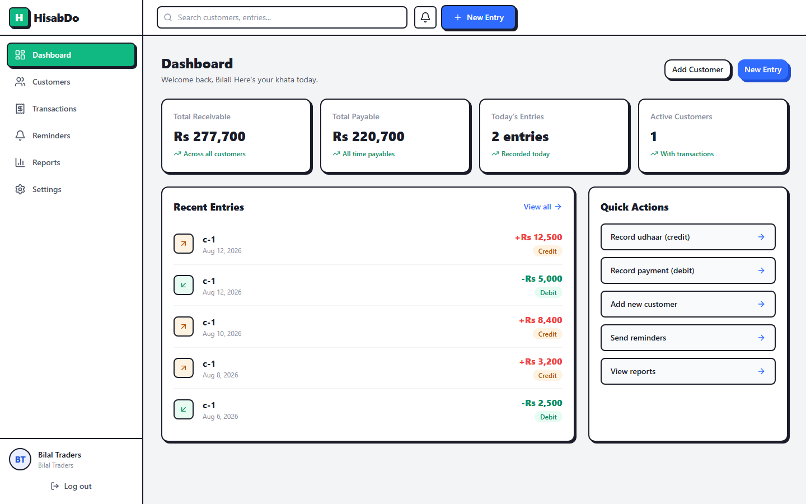 | 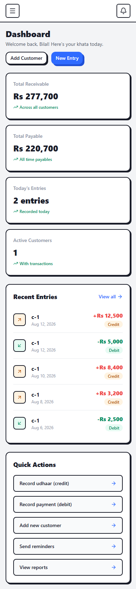 | 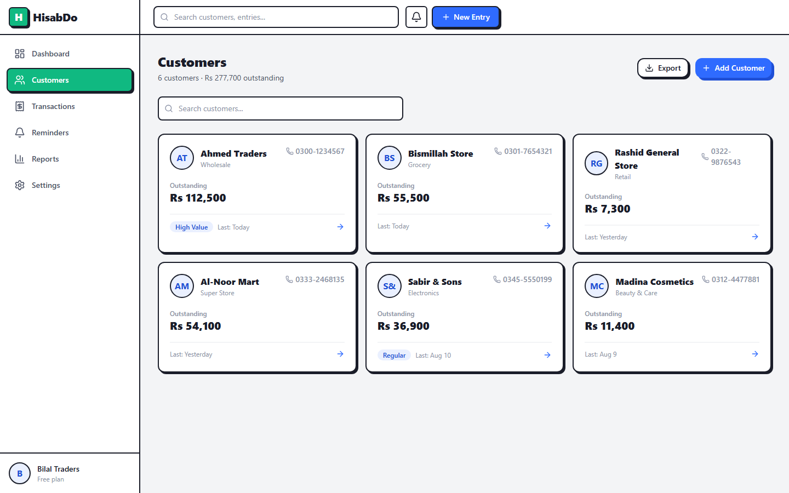 |

| Customer Khata | Transactions | **Reminders (Day 12)** |
|---|---|---|
| 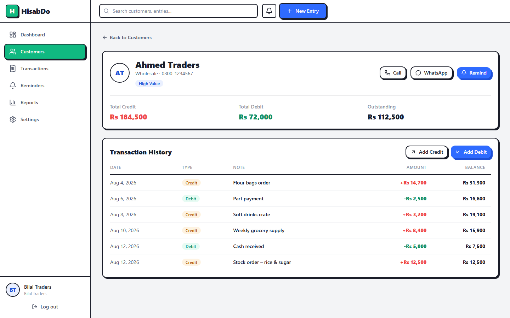 | 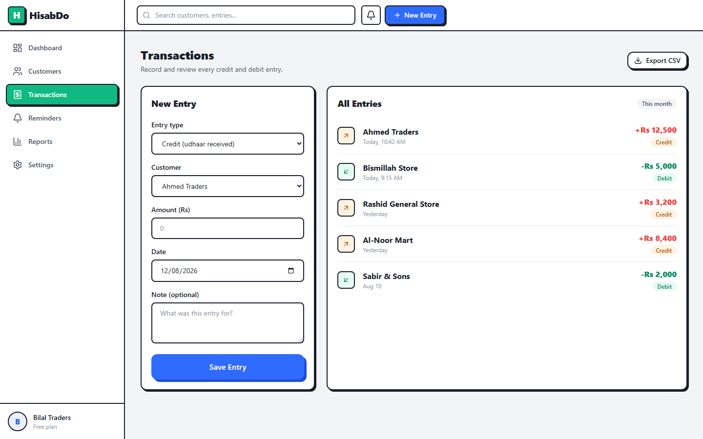 | 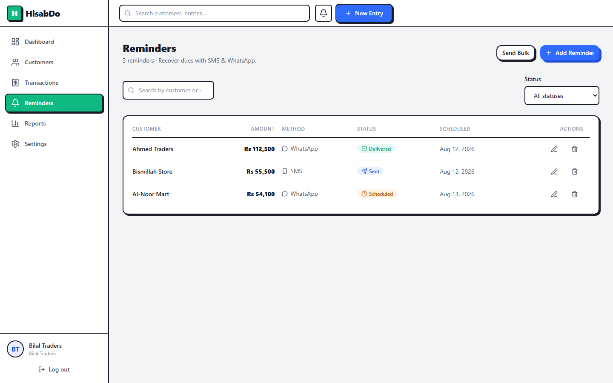 |

### App — Reports & Settings
| Reports | Settings |
|---|---|
| 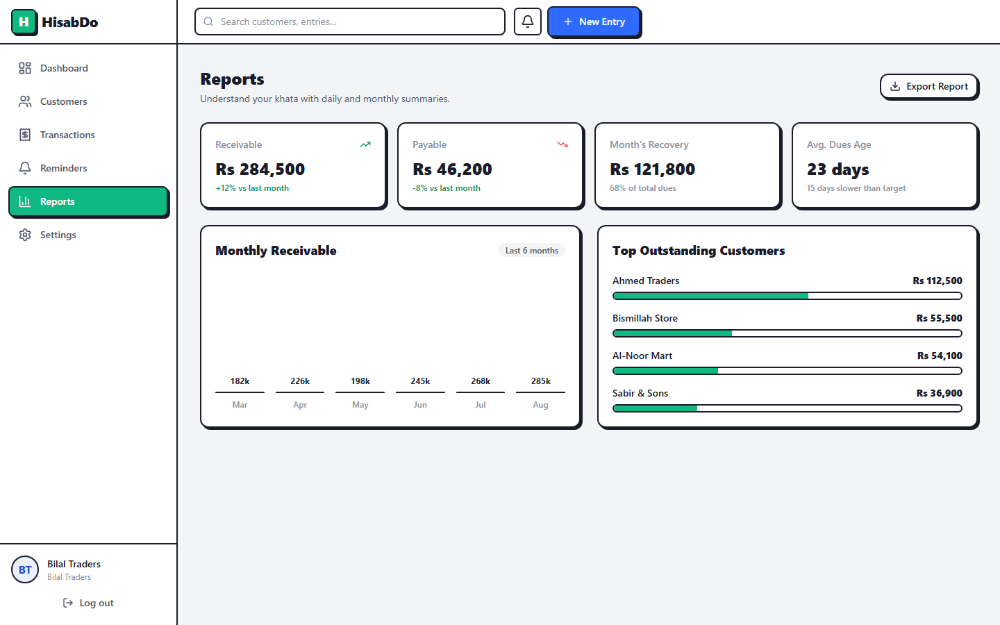 | 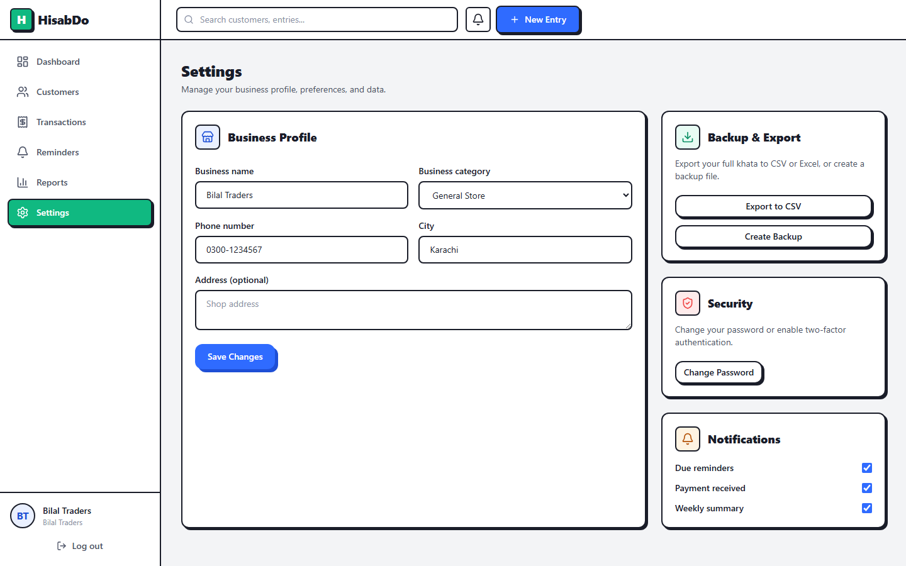 |

### Marketing pages
| Home (desktop) | Home (mobile) | Pricing | Features |
|---|---|---|---|
| 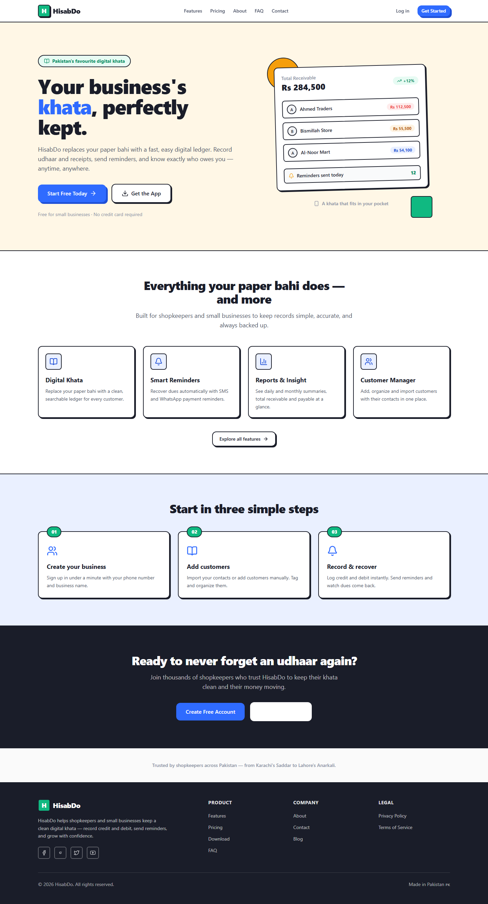 | 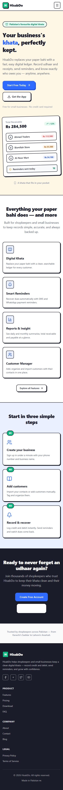 | 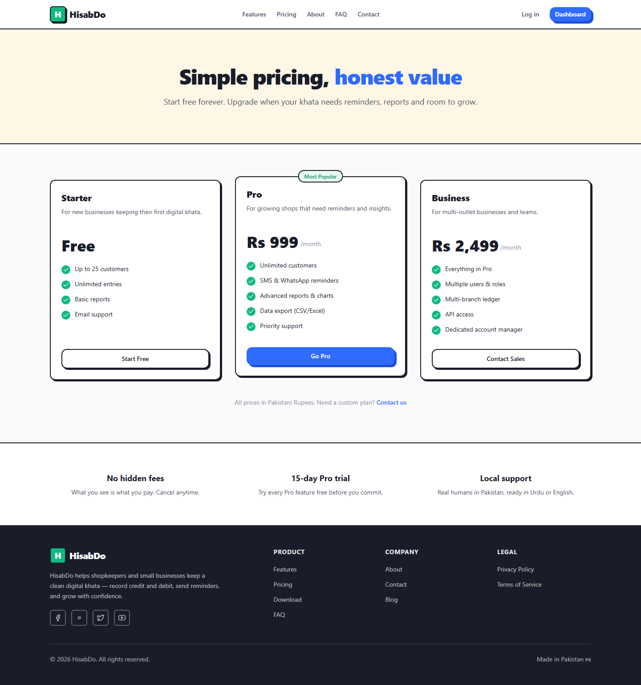 | 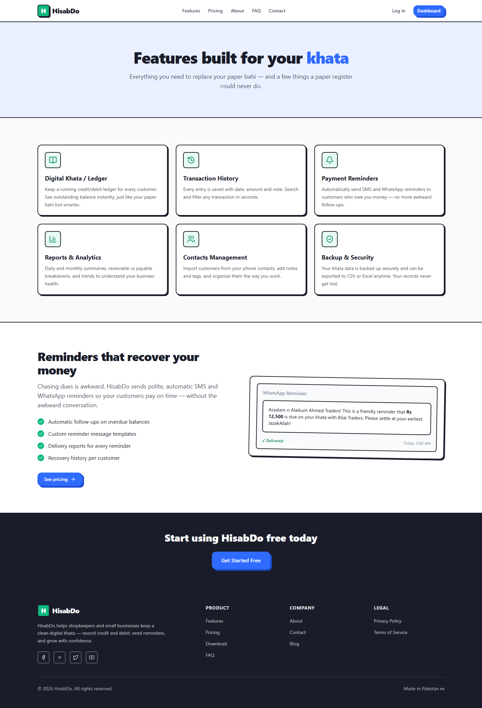 |

---

## Technology Stack

- **Next.js 14** (App Router, RSC + client components)
- **React 18**
- **TypeScript** (strict)
- **Tailwind CSS 3**
- **lucide-react** (icons)
- **ESLint** with `next/core-web-vitals`
- **Playwright** (screenshots — `npm run screenshot`)

---

## Setup & Run

```bash
# Install dependencies
npm install

# Run development server
npm run dev

# Lint
npm run lint

# Type check
npx tsc --noEmit

# Build for production
npm run build

# Start production server
npm start

# Capture screenshots (dev server must be running on port 3000)
npm run screenshot
```

Open [http://localhost:3000](http://localhost:3000) and sign in at `/auth/login`
(phone `0300-1234567`, any password ≥ 6 chars) to access the protected app.

---

## Day 12 Implementation Highlights

### Functional Module 3: Reminders (full CRUD)

- `ReminderContext` provides global state for reminders with async create, read, update, and
  delete, plus `loading` and `error` states.
- `ReminderForm` handles add and edit modes with validation (customer, amount, method, date)
  and is reused inside the reusable `Modal`.
- `RemindersClient` renders a data table on desktop and a card grid on mobile with search and
  a status filter; shows loading, empty, and error states; and confirms deletes via `Modal`.
- Customer names are resolved from `CustomerContext` and link back to each customer's ledger.

### Authentication-protected pages

- `AuthContext` (login/signup/logout) persisted to `localStorage`; `AuthProvider` at the root.
- `ProtectedRoute` guards `/app/*` and redirects unauthenticated users to `/auth/login`.
- Login/Signup forms validate and call the real auth methods.

### Navigation improvements

- AppTopbar "New Entry" → `/app/transactions`.
- Transactions list links customer names to `/app/customers/[id]`.
- Marketing Navbar shows Dashboard when authenticated; Logout in the app sidebar.

---

## Submission Checklist

- [x] GitHub repository — [https://github.com/Bilalrasheedsatti/hisabdo-day12-mern](https://github.com/Bilalrasheedsatti/hisabdo-day12-mern)
- [x] Three functional core modules (Transactions, Customers, Reminders with full CRUD)
- [x] Authentication-protected pages structure (AuthProvider + ProtectedRoute + guarded `/app`)
- [x] Navigation between modules (sidebar, topbar, customer links, quick actions)
- [x] Form validation in all module forms and auth forms
- [x] Loading, empty, and error states
- [x] Responsive UI (mobile, tablet, desktop)
- [x] Reusable components (Button, Card, Badge, Input, Modal, Table, ProtectedRoute)
- [x] Screenshots for all pages (see `screenshots/`)
- [x] ESLint passes with zero errors
- [x] TypeScript type check passes
- [x] Production build succeeds
